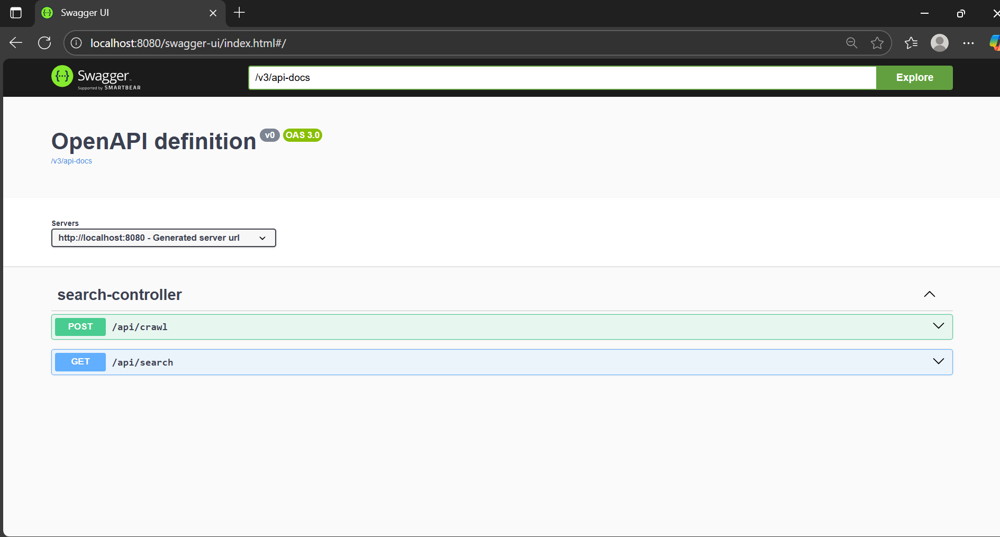
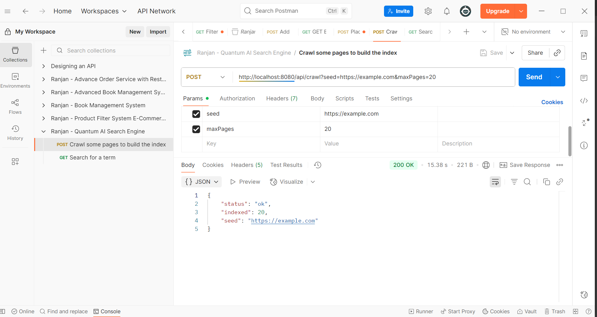
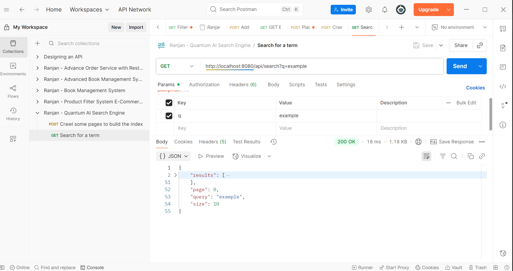
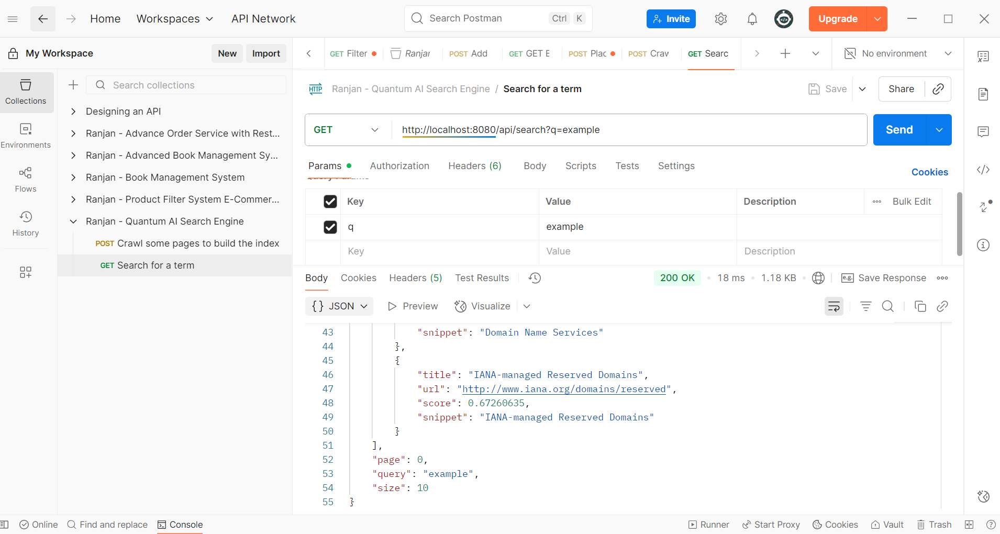

# Quantum AI Enabled Search Engine (Backend Component)

This project is the **backend prototype** for out Quantum AI Enabled Search Engine Project.  It provides REST APIs for crawling web pages, indexing their content using **Apache Lucene**, and retrieving ranked search results. The research is to build a foundation similar to a classical search engine, ready for future integration with **LLM** and **Quantum-AI-based** modules.

---

## 🚀 Features
- **Crawling API** – fetches and indexes pages from a given seed URL
- **Lucene-based indexing and BM25 retrieval** – stores title, URL, and body snippet
- **REST Search API** – simple `/api/search?q=...` interface for frontend clients
- **Pagination support** – `page` and `size` parameters
- **Configurable index path** – via `app.index.path` in `application.properties`
- **Work in progress** – hooks for LLM-based query rewriting and Quantum AI -inspired ranking (planned for Step 2)

---

## 🛠 Tech Stack
| Component       | Technology                                                 |
|-----------------|------------------------------------------------------------|
| Language        | Java 17                                                    |
| Framework       | Spring Boot 3.x                                            |
| Build Tool      | Maven                                                      |
| Search Library  | Apache Lucene 9.11.1                                       |
| HTML Parser     | Jsoup                                                      |
| REST & JSON     | Spring Web / Jackson                                       |
| Container-ready | Spring Boot Maven Plugin                                   |
| Future Add-ons  | LLM-based query expansion, Quantum AI -inspired re-ranking |

## Test Evidences

Swagger UI:

Crawl some pages to build the index:

Search for a term:

### ▶️ Run the App

mvn clean package
mvn spring-boot:run

## API Endpoints

Crawl a site:
curl -X POST "http://localhost:8080/api/crawl?seed=https://example.com&maxPages=20"

Search:
curl -X GET "http://localhost:8080/api/search?q=example"

 
📦 Sample JSON Response

✅ Success
<pre>{
  "id": 1,
  "productId": 1,
  "productName": "Fjallraven - Foldsack No. 1 Backpack",
  "price": 109.95,
  "createdAt": "2025-08-24T13:45:21.123"
}</pre>

❌ Product Not Available
Product not available.

❌ Invalid ID or API Error
Error occurred: 404 Not Found

## Swagger UI
http://localhost:8080/swagger-ui.html

## Roadmap

- LLM-based query rewriting & hybrid vector search
- Quantum AI-inspired Max-Marginal-Relevance re-ranking
- Better snippets & highlighting
- Distributed crawling and indexing
- Frontend UX improvements

## You have some query?
If you have some query, feel free to connect with me here -- [Ranjan Kumar Mandal](https://www.linkedin.com/in/ranjan-kumar-m-818367158/)
